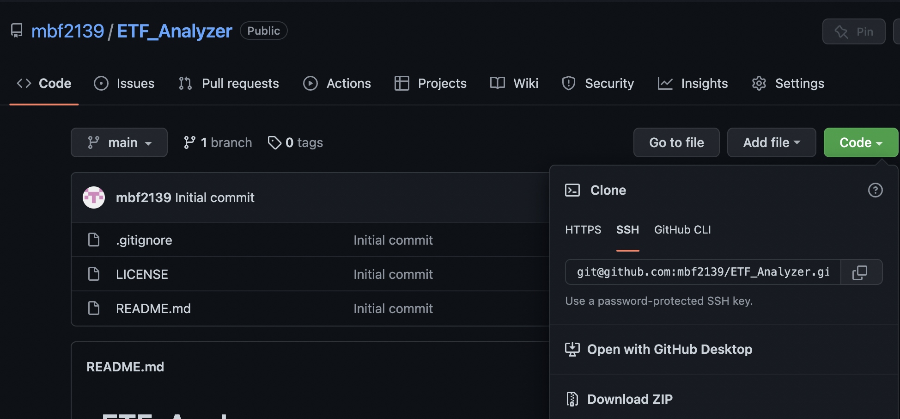
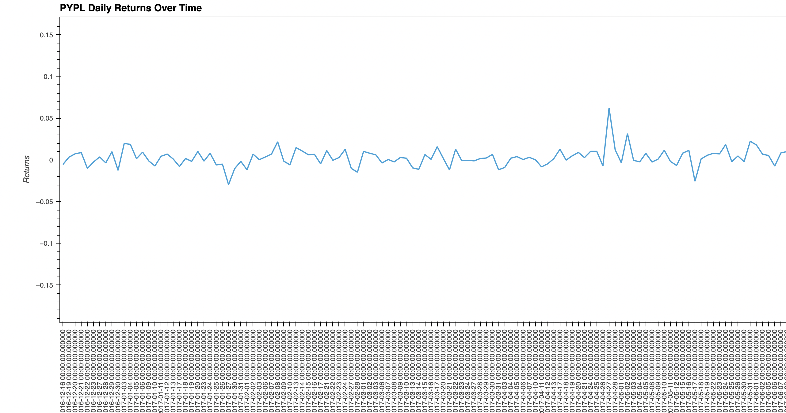
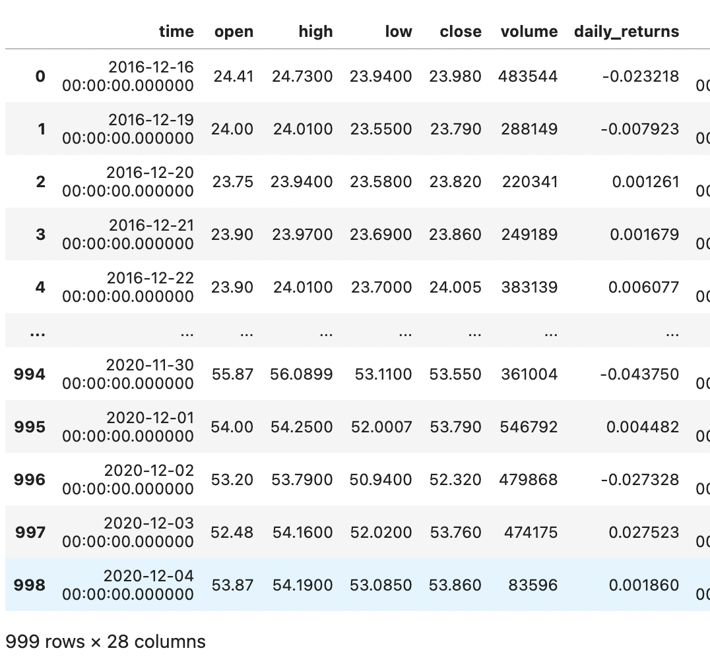
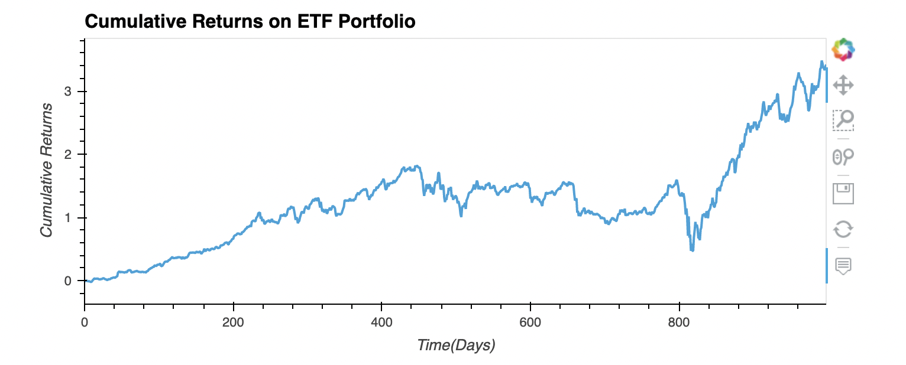
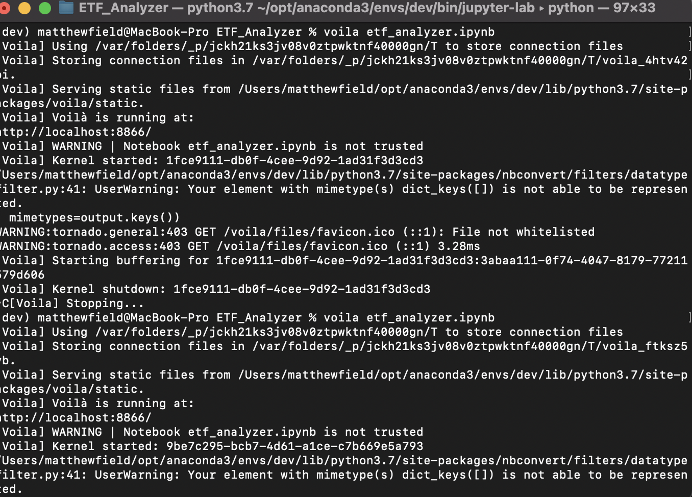

# ETF_Analyzer
ETF Portfolio Analysis Using SQL and VOILA

---
## Technologies 

* [pandas](https://github.com/pandas-dev/pandas) - For data analysis and manipulation.
* [pyviz hvplot](https://github.com/pyviz/pyviz.org) - For interactive data visualizations 
* [numpy](https://github.com/numpy/numpy) - For scientific computing with Python
* [sqlalchemy](https://github.com/sqlalchemy/sqlalchemy) - For SQL Database manipulation 

---

## Installation 

1. Clone the repo

2. Before running the program make sure to install the following dependencies: 

        '''python
         conda install -c pyviz hvplot geoview
         pip install SQLAlchemy
         conda install -c conda-forge voila'''
         
---

## Usage

1. To run the ETF Analysis Application navigate to the ***ETF_Analyzer*** folder within the repo and run the ***etf_analyzer.ipynb*** file

2. In the ***Resources*** folder you will find the database used for this analysis which contains info on the four ETFs

3. In the first section one of the primary outputs is a plot of the PYPL daily returns

4. Following the single assest analysis the user will be required to join all tables in a single DF in order to run analyses on the combined portfolio

5. In the following steps the user will be able to view the average daily returns, the annualized daily returns and the cumulative returns

6. The last step is to initialize the notebook as a web based application using the following code: 
       
       '''voila <notebook_name>'''
       

7. There is a screen recording of the voila process contained in this repo

---

## Contributors

The starter code was contributed by the [FinTech Bootcamp at Columbia Engineering](https://bootcamp.cvn.columbia.edu/fintech/)

Matthew Field finalized the application, his work is availble to view on [Github](https://github.com/mbf2139)

---

## License

MIT
